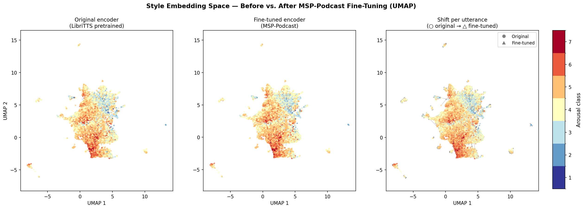
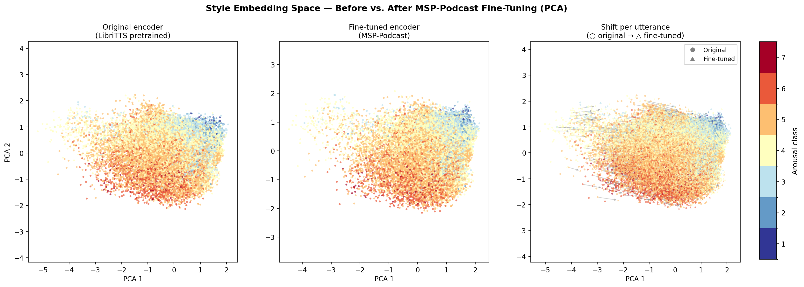

# TargetSEC

[](https://conscht.github.io/TargetSEC/)
[](https://arxiv.org/abs/2606.07293)
[](https://ecs.utdallas.edu/research/researchlabs/msp-lab/MSP-Podcast.html)
[](https://pytorch.org)
[](LICENSE)

**Plug-and-play in-the-wild speech emotion conversion via arousal-conditioned latent style diffusion.**

Move a recorded utterance to a target arousal level without changing what was said or who said it.
A HiFi-GAN decoder is conditioned on HuBERT content tokens, a WavLM speaker vector and a
128-dimensional style vector. During training the style vector comes from a mel style encoder; at
inference that encoder is removed and a latent diffusion model generates the style vector instead,
conditioned on speaker identity and continuous target arousal. The decoder is never modified.


---

## Results

Full MSP-Podcast Test1: 16,903 utterances x 7 target levels = 118,321 conversions per system.

| System | Dur. pred. | WVMOS | WER | *L*<sub>mse</sub> | *L*<sub>abs</sub> | IEMOCAP rho |
|---|---|---|---|---|---|---|
| EmoConv-Diff | no | 2.56 | – | 0.072 | 21.0% | – |
| Uncert | yes | 3.30 | – | 0.069 | **20.0%** | – |
| HiFi-GAN (our reimplementation) | no | 3.27 | 20.7% | 0.087 | 24.5% | 0.325 |
| **TargetSEC** | no | **3.52** | **20.4%** | **0.065** | 20.9% | **0.450** |

Higher is better for WVMOS and IEMOCAP rho; lower is better for WER and both arousal errors.

Reference points: ground-truth Test1 audio scores **3.45** WVMOS, and the arousal recogniser used
for evaluation scores **9.8%** *L*<sub>abs</sub> against human labels on *real* audio — the floor
this metric could ever approach. ECAPA-TDNN speaker similarity is 0.351 +/- 0.12 for TargetSEC and
0.370 +/- 0.12 for the baseline, against a random-pair floor of 0.05.

Aggregating the 118,321 matched pairs by speaker, TargetSEC has the lower arousal error for
**58 of 60** Test1 speakers (paired *t*-test, *p* < 1e-19; `eval/stat_test_paired.py`). That establishes
the gap on this test set for these models — it is not a claim about variance across training seeds.

### Ablation

| Style prior | Speaker cond. | WVMOS | *L*<sub>mse</sub> | *L*<sub>abs</sub> |
|---|---|---|---|---|
| MLP regression | no | 3.80 | 0.081 | 23.7% |
| MLP regression | yes | **3.85** | 0.080 | 23.5% |
| Latent diffusion | no | 3.63 | 0.067 | 21.6% |
| **Latent diffusion** | **yes** | 3.52 | **0.065** | **20.9%** |

Diffusion and speaker conditioning each lower conversion error. WVMOS moves the other way: a
deterministic MLP collapses toward the corpus mean style, which vocodes cleanly and converts poorly.
Higher WVMOS here indicates a safer, less committed prediction, not a better conversion.

---

## How it works

```
Content  HuBERT km100 tokens  -> nn.Embedding(100, 128)
Speaker  WavLM d-vector       -> 512-dim, broadcast over frames
Style    MelStyleEncoder      -> 128-dim        <- replaced at inference
Decoder  HiFi-GAN V1          -> waveform
```

At inference the style slot is filled by the diffusion prior instead:

```
emotion embedding (1024-dim, audeering wav2vec2-large)
speaker embedding (512-dim)
    |  LDM, v-parameterised, 1000 training steps / 100 inference steps
    |  classifier-free guidance w = 4, rescale phi = 0.7
    v
style vector (128-dim)  ->  HiFi-GAN decoder  ->  waveform
```

Target emotion embeddings are top-20% class averages per arousal level. Because only the prior is
retrained, any other continuous or discrete style conditioning can be swapped in without touching
the synthesis backbone.

### Style encoder fine-tuning

The MelStyleEncoder (Meta-StyleSpeech, ~500 K params) is pretrained on LibriTTS and fine-tuned on
MSP-Podcast jointly with the decoder at a 10x lower learning rate. Points below are coloured by
arousal class (1 = calm, 7 = activated); arrows show the per-utterance shift from the pretrained to
the fine-tuned encoder, over all 16,903 Test1 utterances.

| UMAP | PCA |
|---|---|
|  |  |

---

## Layout

```
train/        the four pipeline stages, the baseline, and the pre-flight loss gate
eval/         benchmarks, WVMOS, WER, speaker similarity, IEMOCAP, significance tests
tools/        figures, grid search, one-off regeneration utilities
slurm_jobs/   one sbatch script per entry point above
src/
  dataset.py                     Train / Development / Test1 loaders, split guard
  synthesizer_style_module.py    Stages 1-2: decoder + mel style encoder
  synthesizer_hifigan_module.py  The HiFi-GAN baseline (scalar arousal -> emo_proj)
  diffusion_module_fixed.py      Stage 4: the latent style LDM
  decoder/decoder.py             HiFi-GAN generator, MPD + MSD discriminators
  emotion/emotion_encoder.py     Frozen SER, differentiable wrapper, functional CCC
processing/
  mel_differentiable.py          torch mel that keeps the autograd graph intact
Ablation/                        MLP style prior (the deterministic baseline)
docs/                            Project page (GitHub Pages) and checkpoint manifest
```

Scripts live in packages rather than the root, so each sbatch job exports
`PYTHONPATH="$PWD"` and is launched from the repository root.

---

## Training

Four stages. Each sbatch script pins an A100 (`-C GPU_SKU:A100`) — the Blackwell RTX 6000 (sm_120)
is unsupported by this torch build.

```bash
# 1. Decoder, style encoder frozen
sbatch slurm_jobs/training.slurm

# 2. Unfreeze the style encoder, lower learning rates
sbatch slurm_jobs/finetune_synthesizer.slurm

# 3. Style latent statistics over Train
sbatch slurm_jobs/compute_style_stats_finetune.slurm

# 4. The diffusion prior
sbatch --export=ALL,FT_CKPT=<stage2.ckpt>,STATS=<style_stats.pt> \
       slurm_jobs/train_ldm_finetune.slurm
```

The HiFi-GAN baseline is a reimplementation of Prabhu et al.
([arXiv:2306.01916](https://arxiv.org/abs/2306.01916)), trained on identical splits with identical
checkpoint selection:

```bash
sbatch slurm_jobs/training_hifigan_baseline.slurm
```

It is trained **without** the *L*<sub>SER</sub> term, because optimising through the same recogniser
used for evaluation couples the model to the metric. It nevertheless reproduces the WVMOS and
*L*<sub>abs</sub> that paper reports for its +*L*<sub>SER</sub> configuration.

`train/verify_hifigan_losses.py` runs from the sbatch script before training starts, as a pre-flight gate:
it asserts that the mel and SER losses actually carry gradients, that the discriminator has the
expected number of sub-discriminators, and that the split guard fires.

---

## Evaluation

```bash
sbatch --export=ALL,SY=<stage2.ckpt>,LD=<ldm.ckpt>,SAVE_ROOT=<out> \
       slurm_jobs/bench_targetsec_full.slurm   # arousal error + WVMOS, full Test1
sbatch slurm_jobs/bench_baseline_full.slurm    # the same for the baseline
sbatch --export=ALL,WAV_ROOT=<out>/wav slurm_jobs/wer_only.slurm
sbatch slurm_jobs/evaluate_speaker.slurm       # ECAPA-TDNN similarity
sbatch slurm_jobs/second_emotion_eval.slurm    # IEMOCAP rank correlation

python eval/stat_test_paired.py                # speaker-clustered paired test
python tools/plot_arousal_figure.py            # per-level figure (all four systems)
```

Checkpoints are not in this repository; the paths they are expected at are listed in
[`docs/frozen_checkpoints.md`](docs/frozen_checkpoints.md).

---

## Data

**MSP-Podcast v1.10**, 16 kHz spontaneous conversational speech, obtained under licence from the
University of Texas at Dallas. The official partitions are used as published:

| Partition | Utterances | Role |
|---|---|---|
| Train | 63,076 | gradients |
| Development | 10,999 | validation and checkpoint selection |
| Test1 | 16,903 | evaluation only |

Preprocessing produces HuBERT km100 tokens and WavLM speaker embeddings under
`hubert-km100/parsed_with_spkrEmbeds/`. Set the corpus root in `src/dataset.py`.

---

## Environment

Python 3.10, PyTorch 2.3.1, PyTorch-Lightning 2.3.0, transformers 4.41, diffusers 0.18,
librosa 0.9, wvmos 1.0.

```bash
conda create -n emoldm python=3.10
conda activate emoldm
pip install -r requirements.txt
```

### Setup

Two things are not vendored here and have to be put in place before anything runs.

**1. Meta-StyleSpeech.** `MelStyleEncoder` is imported from it by eleven modules, under its own
licence, so it is not redistributed in this repository:

```bash
git clone https://github.com/KevinMIN95/StyleSpeech.git StyleSpeech
```

**2. The corpus root.** Paths default to the cluster this was developed on. Point them at your own
copy of MSP-Podcast with one environment variable — it is read by `src/dataset.py` and
`processing/dataset_diffusion.py`:

```bash
export TARGETSEC_DATA_ROOT=/path/to/parent/of/MSP-Podcast-1.10
```

The directory it points at is expected to contain `mel_spectograms/{Train,Development,Test1}/`,
`Audio/Audio/`, `Audio/MSP-Podcast-1.10/hubert-km100/parsed_with_spkrEmbeds/` and
`emotion_embeddings/`.

Scripts under `eval/` and `tools/` still carry cluster-specific *defaults* for output directories;
the ones used in the pipeline above take them as arguments instead. Run every script from the
repository root.

### Tests

```bash
PYTHONPATH="$PWD" pytest tests -q
```

Ten checks, no GPU, corpus or network required. They cover the two failure modes that invalidated
an earlier revision: that the mel reconstruction loss and the CCC emotion loss both carry
gradients rather than being computed and discarded, that the torch mel still matches the
TacotronSTFT that wrote every cached `*_mel.pt`, and that the loaders refuse to be pointed at
Test1.

---

## Citation

```bibtex
@article{auga2026targetsec,
  title         = {TargetSEC: Plug-and-Play In-the-Wild Speech Emotion Conversion
                   via Arousal-Conditioned Latent Style Diffusion},
  author        = {Auga, Constantin Alexander},
  year          = {2026},
  eprint        = {2606.07293},
  archivePrefix = {arXiv}
}
```

## Licence

Code is MIT, see [LICENSE](LICENSE). This does not cover MSP-Podcast, the demo audio derived from
it, or the pretrained third-party models (HuBERT, WavLM, the audeering dimensional SER,
wav2vec2-MOS), each of which carries its own terms.
